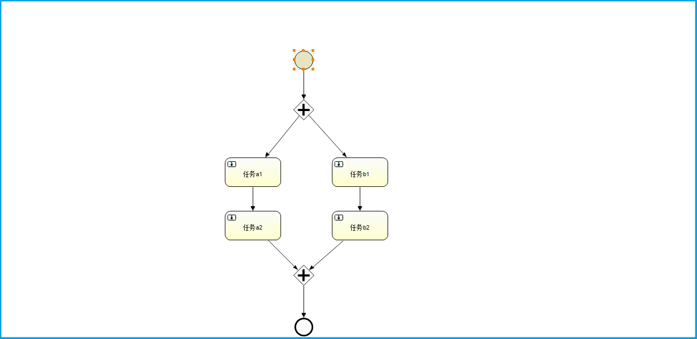
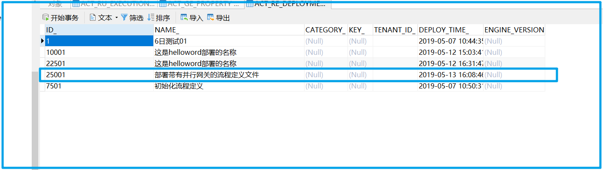
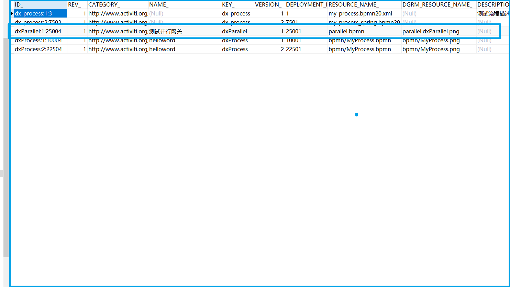
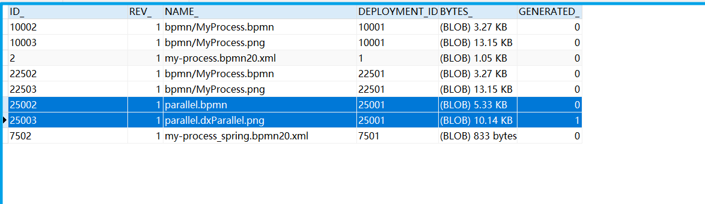
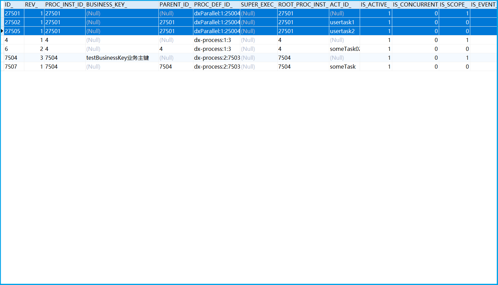
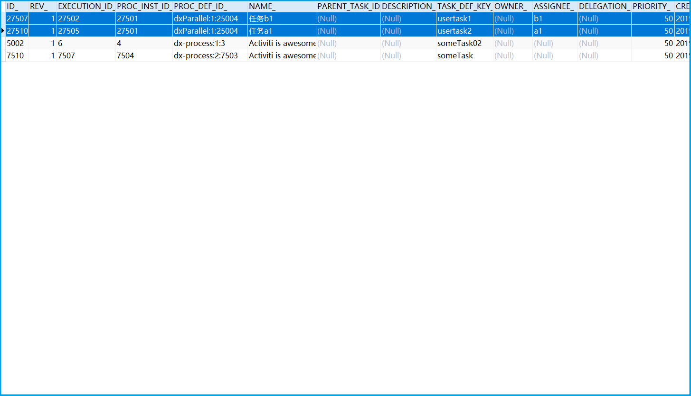
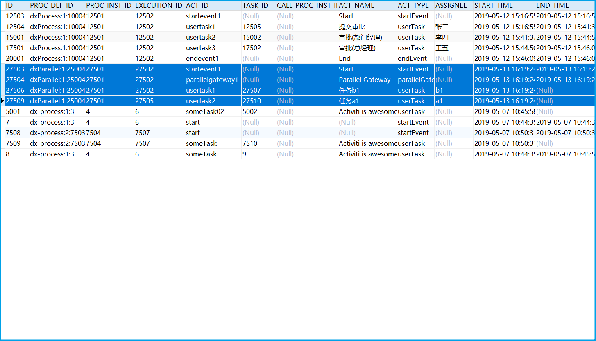
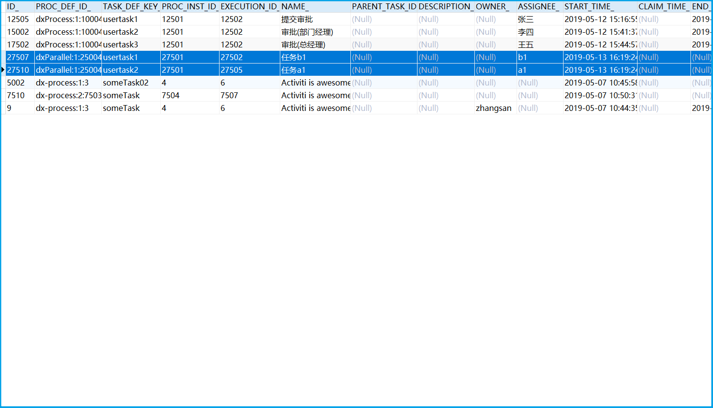

# 6.x版本后Execution与ProcessInstance

> 新版本就算只有一个流程的情况下,启动一个流程实例时在RU_EXECUTION中也会有两条记录,如果有两条路线可以走,那么执行对象会有两条记录,以及一条流程实例对象

## 场景

如图我们有这样一个流程定义文件,在部署成功后我们可以启动一个对应的流程实例。

## 启动流程实例在数据库中的体现

新增的数据会标记起来

RE_DEPLOYMENT表

RE_PROCEDEF表

GE_BYTEARRAY资源表

RU_EXECUTION表

这里我们就可以看出,一点上图中的流程定期启动,就会产生一个流程实例对象以及两个流程执行对象,流程实例对象继承自流程执行对象,所以流程实例对象包含流程执行对象,在数据库中也表现出了这种包含关系,通过PARENT_ID字段。

RU_TASK表

任务表同时会出现两个任务

HI_ACTINST活动实例表

HI_TASKINST历史任务实例表

