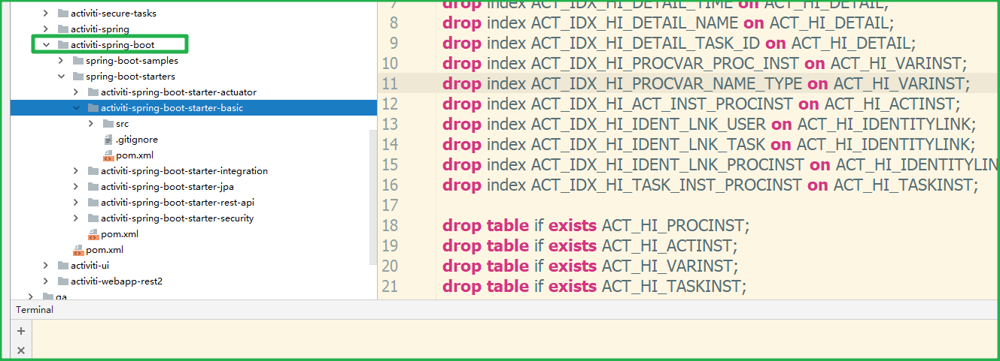
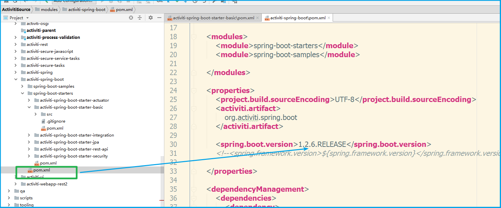

# 魔改activiti启动器
> 解决在springboot2.0工程中引入activiti
>
> 由于在activiti6.0在发布的时候,spring-boot2.0并没有发布,所以activiti6.0提供的启动器,并不能直接用于spring-boot2.0,本篇章就是为了解决这个问题。
>
> 2019年5月11日  晴

## 为什么要与springboot进行集成

还是因为两点:

1. 自动配置
2. 依赖管理

回想起我们自己配置ProcessEngine的场景,如果能引入一个起步依赖然后通过@Autowired直接注入一个合适的ProcessEngine(或各种Service)岂不美哉,又能减少配置,又能防止重复配置可能产生的人为错误,何乐不为呢!

题外话,如果不想魔改activiti的启动器,又想在springboot项目中使用,其实完全可以参考shiro在springboot项目中的使用方式,直接把xml修改成java类的配置方式,然后该注入的注入,该调用的调用就行了。

不使用启动器,肯定也是可以在springboot项目中使用的。只要想办法把activiti中的关键类加入到核心容器中,通过spring管理这些类,完成功能增强(aop、事务等),或是依赖注入就可以了。这样整与springboot起步依赖相比大约有以下缺点:

1. 依赖是我们自己管理的,依赖本身的版本号,或者依赖内部依赖的别的版本号等,我们引入相当于是一个jar包而不会想springboot一样是一个功能。
2. 肯定也是不能直接通过application.yml对我们框架进行设置了(通过属性读取器是可以,但是肯定不启动器方式麻烦的)

## 突然想通的依赖注入优点

在想要用的时候不用自己new了,如果有修改,直接把配置文件(@Configuration、xml)一修改,不用像老黄牛一样修改每个类出现的地方!!!别看这个问题不大,但是如果你的框架中你自己new了500个类了,然后觉得这个类的构造方法需要改变,如果不是通过依赖注入的方式,那么这个项目基本上是可以放弃了,修改这500个对象因为构造方法的改变带来的错误,就已经让人崩溃了。

其实依赖注入更多的优势是简化框架开发者的开发难度,如果我们在自己的项目中只是使用现成的框架,还真不能感受到依赖注入有多么牛逼。最起码起来注入让我们完全不用搞懂工厂模式了,当然还有很多特点!业界流传的一句话spring让java设计模式消失,可不是一句空话。

## 在不使用activiti启动器的情况下,在springboot的项目中使用activiti

1. 通过xml的方式
2. 通过springConfig的方式

其实归根结底都是方式2。

## 集成可能会出现的问题

因为activiti6.0的启动器是基于spring-boot1.2.x版本来的。所以直接在spring boot2.0的项目中引入启动器,会发生编译错误。所以activiti6.0与springboot2.0是不能直接使用的。

## 前置条件

1. 对springboot有一定的了解,最起码得知道一点源码方面的东西。
2. 对maven的模块化有一点点了解,因为我们魔改的activiti启动器,肯定不会再中央仓库出现的。
3. 对Git有一点点了解,在Github上把activiti6.0的源码下载下来。

## 将要完成工作

1. 保证springboot1.x下能正常工作,然后升级到2.x,并解决编译报错的问题
2. 更新activiti-spring-boot-starter-basic版本,并安装到本地仓库
3. 引入坐标,并使用使用启动器进行开发测试

### 准备工作

首先将下载好的源码切换到activiti-6.0的分支。

我们想要将activiti的启动器升级到2.0兼容的版本,需要找到启动器依赖在什么位置。我们该如何去寻找呢。找的思路无非就两种:**顺藤摸瓜、全局搜索。**

在观察和顺藤摸瓜下,我们可以找到这样一个模块:

我们可以找到这样一个依赖

这就是activiti启动器依赖的springboot的版本